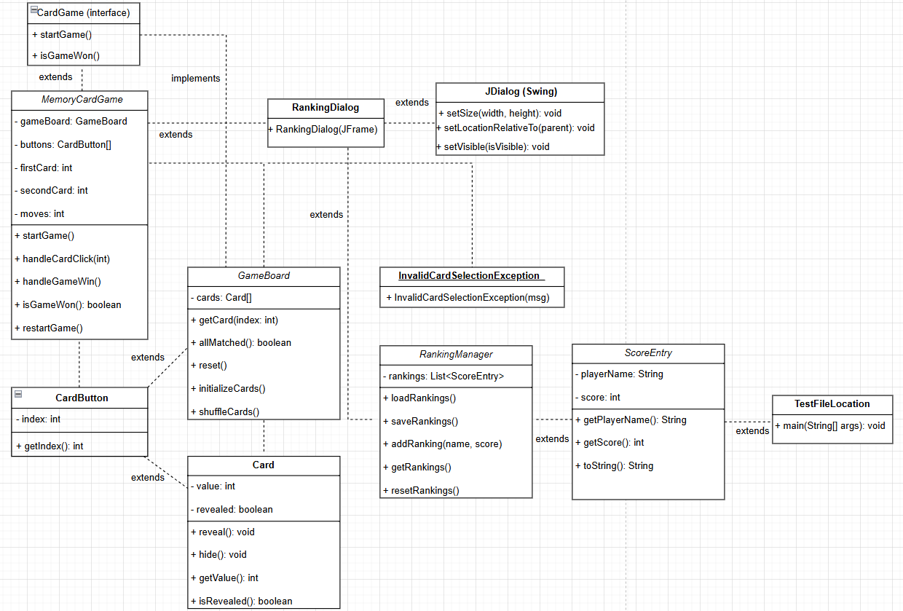
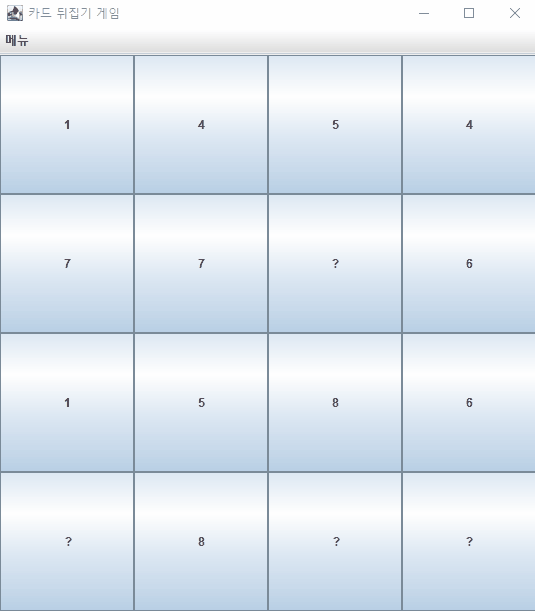
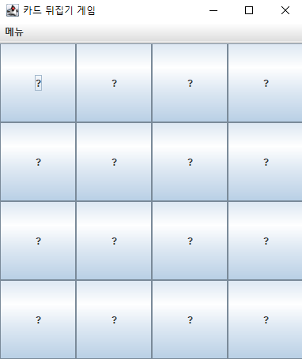
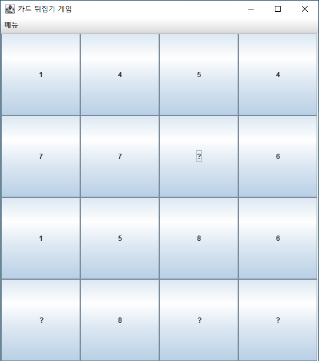
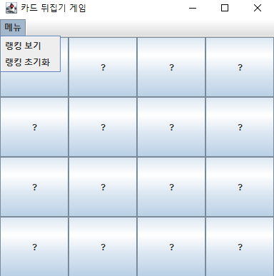
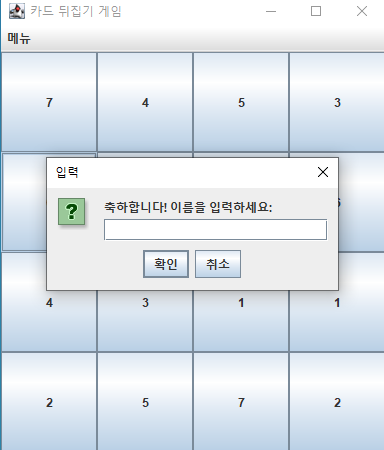
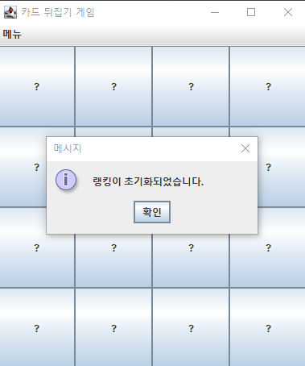
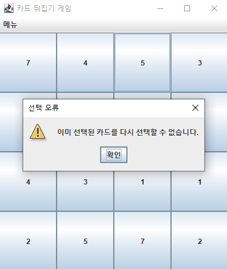
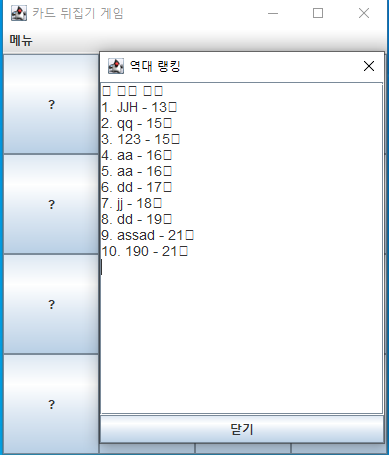

# 🃏 Java Mini Project: 카드 뒤집기 게임 (Card Matching Game)

Java Swing 기반의 기억력 향상 카드 매칭 게임입니다.  
`JPanel`, `JFrame`, `ActionListener` 등을 활용하여 직관적인 UI와 이벤트 기반 카드 매칭 로직을 구현했습니다.

## 📦 주요 기능

- 동일한 그림을 맞추는 고전 카드 짝 맞추기 게임
- 클릭 이벤트 기반의 카드 뒤집기 로직
- 성공/실패 시 시각적 피드백 제공
- 점수 시스템 구현 (선택사항)
- 게임 초기화 및 재시작 기능
- 랭킹 등록 및 조회 기능
- 예외 상황에 대한 메시지 처리

## 📚 클래스 다이어그램

게임의 구조를 보여주는 클래스 다이어그램입니다.

---

## 🎞️ 게임 시연 이미지

### 🔄 애니메이션

### 🏁 초기화

### 🎮 메인 게임 화면

### 🏆 랭킹 메뉴

랭킹 보기와 랭킹 초기화를 관리할 수 있는 메뉴입니다.

### 📋 순위 등록 화면

모든 숫자를 맞추면 몇회 시도만에 성공했는지 순위를 등록 할 수 있는 화면입니다.

### ♻️ 다시 시작 버튼

모든 숫자를 맞추

### 🧹 순위 초기화

### ⚠️ 에러 알림

### 📊 히스토리 순위

